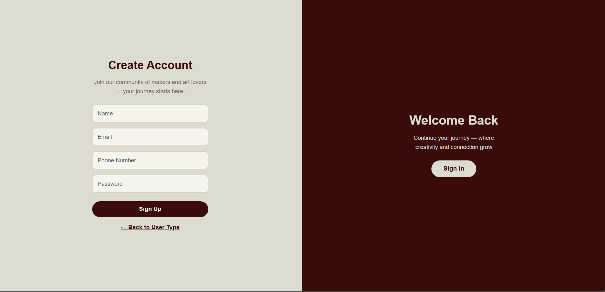
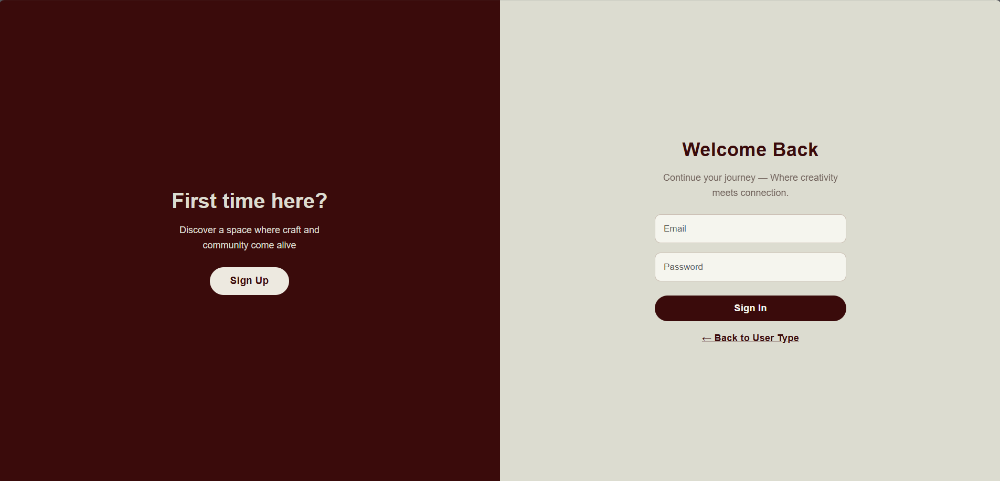
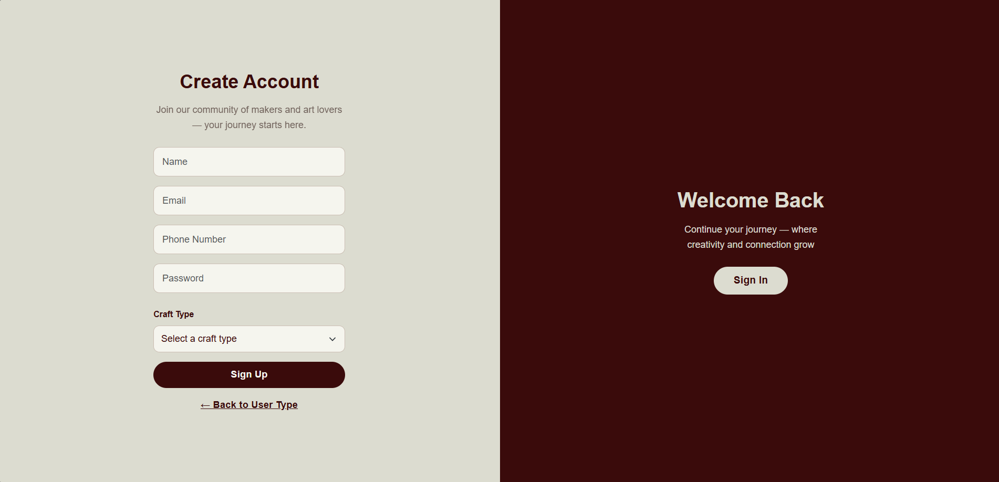
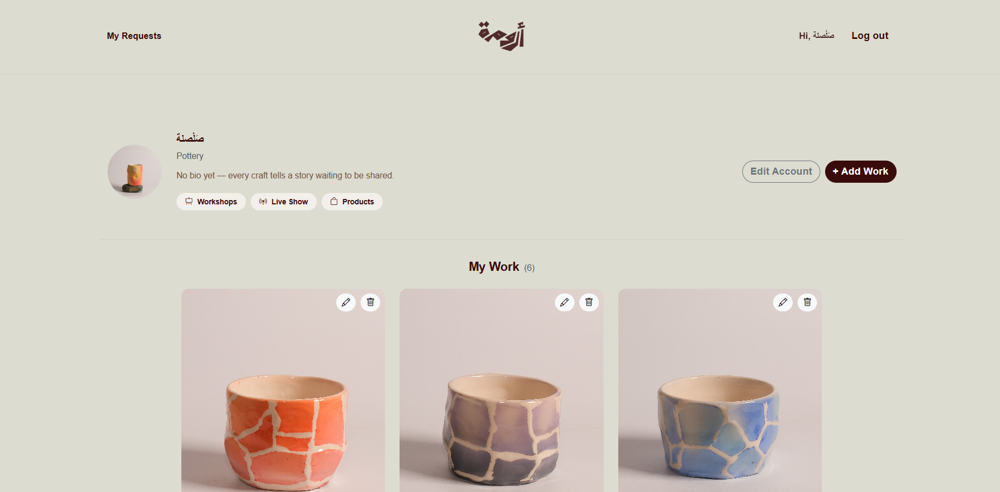
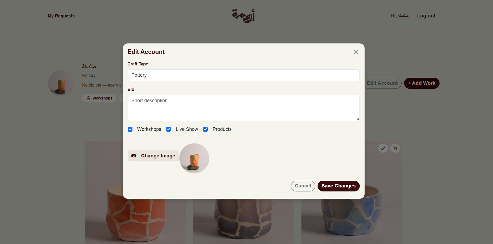
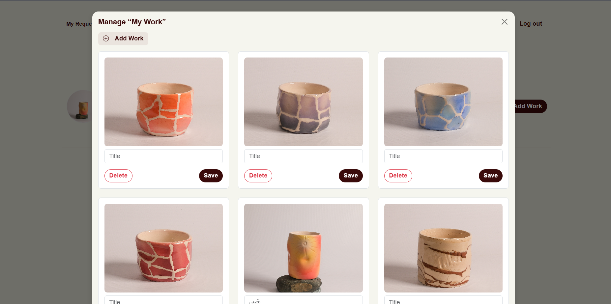
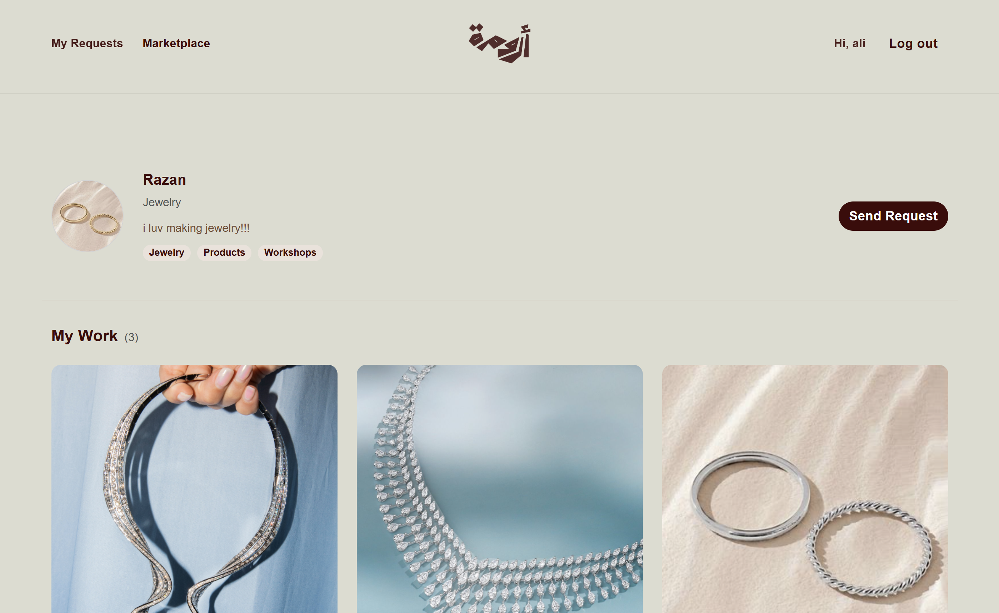
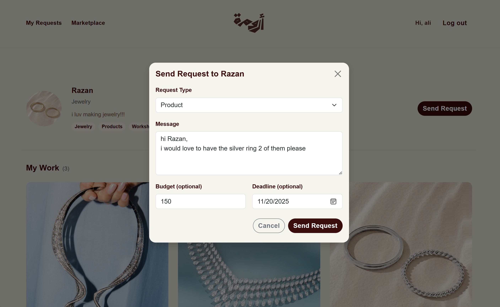
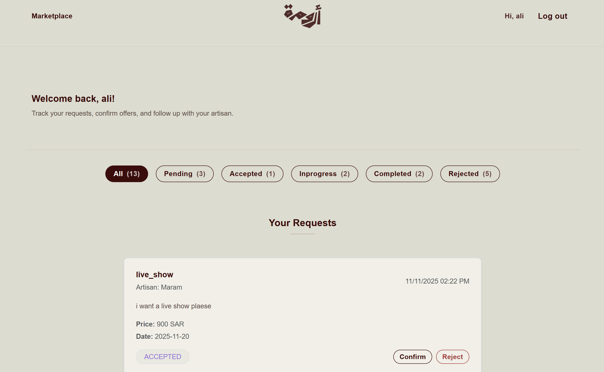

  

---

# Aruma

> A digital platform that empowers artisans to showcase their products and services, reach more clients, and strengthen their market presence through a comprehensive online space.

---

## 🌐 Live Demo

- **Live Website:** [Go to Aruma Website](https://aruma-seven.vercel.app/)

---

## 🎯 Project Overview

Many Saudi artisans struggle to find a unified digital space to present their handcrafted work, manage requests, and connect with modern clients.  

**Aruma** was created to bridge that gap by providing:

- A **dedicated profile** for artisans to present their work.
- A **marketplace** where clients can discover artisans.
- A **request and tracking system** connecting both sides.

This project was developed collaboratively as part of a portfolio project for [Holberton School](https://www.holbertonschool.com/) Supervised by [Tuwaiq Academy](https://tuwaiq.edu.sa/), and represents our shared vision to combine technology and culture in a meaningful way.

---

## ✨ Features

Aruma serves **two main user types**: **artisans** and **clients**.  
Below is an overview of the main features currently implemented in the platform.

### 1. User Type Selection

Through the **User Type** page, users can choose whether they want to continue as an **artisan** or a **client**, ensuring a tailored experience from the start.

**Screenshot:**

---

### 2. Client Registration & Login

Clients can:

- Create an account with their basic information.
- Log in to access their profile and request history.

**Screenshots:**

- **Client Registration**
  

- **Client Login**  
  

---

### 3. Artisan Registration & Login

Artisans can:

- Register to create their artisan profile.
- Log in to manage their profile and work.

**Screenshots:**

- **Artisan Registration**  
  

- **Artisan Login**  
  

---

### 4. Marketplace Browsing

Clients can browse a curated **marketplace** of artisans:

- View artisan cards and short info.
- Open detailed profiles to learn more and request services.

**Screenshots:**

- **Marketplace View**  
  
  

---

### 5. Artisan Profile Management

Artisans can manage all details shown on their public profile:

- View how their profile appears to clients.
- Edit account information.
- Manage the “My Work” section with their offerings.

**Screenshots:**

- **Artisan View To their Profile**  
  

- **Edit Account Form**  
  

- **Manage My Work Form**  
  

---

### 6. Browsing Artisan Profile & Sending Requests

From the client side, users can:

- Open an artisan’s profile page.
- View detailed information about the artisan's work.
- Send a request using a dedicated request form.

**Screenshots:**

- **Client View of Artisan Profile**  
  

- **“Send Request” Form**  
  

---

### 7. Requests Tracking

Both **artisans** and **clients** can track the status of their requests:

- Artisans see requests received from clients.
- Clients see requests they have sent to artisans.

**Screenshots:**

- **Artisan View of Requests**  
  

- **Client View of Requests**  
  

---

## 🛠️ Tech Stack

### **Frontend**
- React (Vite)
- React Router
- Bootstrap 5
- Custom UI Components

### **Backend**
- FastAPI (Python)
- Uvicorn (Development Server)

### **Database**
- Supabase (PostgreSQL + Auth + Storage)

### **Deployment**
- **Frontend:** Vercel  
- **Backend:** Render

---

## 👩‍💻 Our Developers

| Name              | Role                                  | LinkedIn | GitHub |
|-------------------|----------------------------------------|----------|--------|
| **Maram Alsofyani** | Frontend Developer, UI/UX Designer
 | [LinkedIn](https://www.linkedin.com/in/maram-alsufyani-b2a761259?utm_source=share&utm_campaign=share_via&utm_content=profile&utm_medium=android_app) | [GitHub](https://github.com/maram-ra) |
| **Shurooq Alabbadi** | Frontend Developer & QA Engineer      | [LinkedIn](https://www.linkedin.com/in/shurooq-alabbadi-1738131b6?utm_source=share&utm_campaign=share_via&utm_content=profile&utm_medium=android_app) | [GitHub](https://github.com/ShAlabbadi) |
| **Razan Alabdulhadi** | Backend Developer & QA Engineer       | [LinkedIn](https://www.linkedin.com/in/razan-alabdulhadii-?utm_source=share&utm_campaign=share_via&utm_content=profile&utm_medium=android_app) | [GitHub](https://github.com/CODERrazan) |
| **Layan Aljunayh**   | Backend & Database Developer          | [LinkedIn](https://www.linkedin.com/in/layan-aljunayh-?utm_source=share&utm_campaign=share_via&utm_content=profile&utm_medium=android_app) | [GitHub](https://github.com/CoderLayan) |

---
