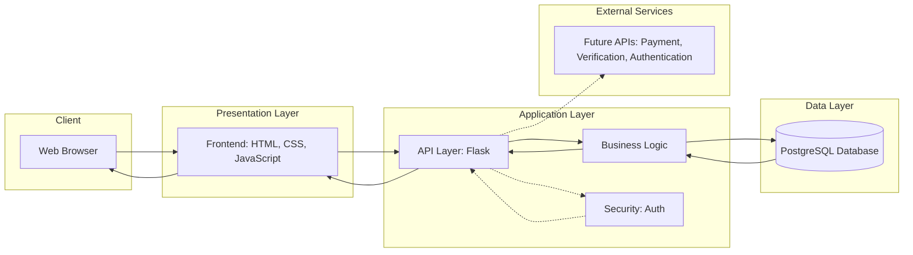

# User Stories

## Must Have (MVP)

### 1. User Registration & Login
- As an **artisan**, I want to register and log in, so that I can manage my profile.  
- As a **client**, I want to register and log in, so that I can browse artisans and send requests.  

**MVP Scope:**  
Basic authentication with email and password. No social logins or advanced security required at this stage.  

**Acceptance Criteria:**  
1. Given a new user submits valid registration info  
2. When they confirm the form  
3. Then the system saves their account and redirects them to login.  

---

### 2. Artisan Profile
- As an **artisan**, I want to create and update my profile with details and images, so that clients can view my work.  
- As a **client**, I want to view artisan profiles, so that I can evaluate their work.  

**MVP Scope:**  
Profile includes name, bio, craft type, and images. No advanced customization or categories.  

**Acceptance Criteria:**  
1. Given an artisan logs in  
2. When they update their profile details  
3. Then the system saves the changes and updates their public profile.  

---

### 3. Marketplace Browsing
- As a **client**, I want to browse artisans in a marketplace, so that I can discover products, workshops, and live shows.  
- As an **anonymous visitor**, I want to preview the marketplace, so that I can see artisans before registering.  

**MVP Scope:**  
Simple list/grid of artisans with name, short bio, and one featured image. No filters or advanced search.  

**Acceptance Criteria:**  
1. Given I am on the marketplace page  
2. When I scroll through the list  
3. Then I can view artisan profiles with minimal details.  

---

### 4. Collaboration Requests
- As a **client**, I want to send a request to an artisan, so that I can collaborate with them.  
- As an **artisan**, I want to accept or reject client requests, so that I can control my work.  

**MVP Scope:**  
Request form includes type (product/workshop/live show) and a message. Artisans can accept or reject only. No messaging or chat.  

**Acceptance Criteria:**  
1. Given a client sends a request  
2. When the artisan reviews it  
3. Then they can accept or reject the request with one click.  

---

### 5. Basic Contract Flow
- As an **artisan**, I want to specify cost and timeframe when accepting a request, so that the client knows the conditions.  
- As a **client**, I want to confirm the artisan’s terms, so that we both agree on a clear contract.  
- As a **system**, I want to track request status (pending, accepted, rejected, completed).  

**MVP Scope:**  
Simple status tracking only. No legal documents or payment integration.  

**Acceptance Criteria:**  
1. Given a request is accepted  
2. When the artisan enters cost and timeframe  
3. Then the client can confirm, and the system updates the contract status.  

---

### 6. Profile Enhancement
- As an **artisan**, I want completed requests to appear on my profile, so that I can build credibility with clients.  

**MVP Scope:**  
Show a list of completed requests in the artisan profile. No ratings or reviews.  

**Acceptance Criteria:**  
1. Given an artisan marks a request as completed  
2. When the contract is closed  
3. Then the system adds this request to the artisan’s profile under “Completed Work.”  

---

## Future Features

### 1. Payment Integration
- As a **client**, I want to pay securely through the platform, so that I can complete transactions without external tools.  

### 2. User Reviews & Ratings
- As a **client**, I want to leave reviews and ratings on artisan profiles, so that I can share my experience with others.  
- As an **artisan**, I want to receive feedback, so that I can improve my services and gain more credibility.  

### 3. Service Verification
- As a **platform admin**, I want to verify artisan identities and award badges, so that clients can trust the legitimacy of services.  

---

## Notes
- **Adapt to the MVP:** Stories are scoped to the simplest working version.  
- **Collaborate Actively:** Each story is owned by one team member but reviewed collectively.  
- **Keep it Clear and Simple:** Features are described in plain language with clear acceptance criteria.

---
##  System Architecture

### Purpose
To illustrate how the MVP components (frontend, backend, database, and external services) interact with each other, and how data flows between them.

---

### Proposed Tech Stack for Aruma
- **Frontend:** HTML, CSS, JavaScript (basic web pages for the MVP).  
- **Backend:** Node.js (Express) — handles requests and business logic.  
- **Database:** MongoDB (to store users, profiles, requests, and contracts).  
- **External APIs:** Not required for the MVP (future integrations may include payment gateways or identity verification).  

---

### High-Level Architecture Diagram

---

## 2. Backend Components & Classes

### 2.1 Artisan Class
**Purpose:** Represent artisan and handle authentication and profile management.

**Attributes:**
- `artisan_id` (int, PK)
- `name` (string)
- `email` (string, unique)
- `password` (string)
- `craft_type` (string)
- `bio: string`
- `craftType: string`
- `images: string[]`
- `offersWorkshop: boolean`
- `offersLiveShow: boolean`
- `completedWorkCount: number`
  
**Methods:**
- `register()` – Save new user to database.
- `login()` – Authenticate user credentials.
- `update_profile()` – Update user details.
- `get_profile()` – Retrieve public profile info.

---

### 2.2 client Class
**Purpose:** Represent client and handle authentication and profile management.

**Attributes:**
- `client_id` (int, PK)
- `name` (string)
- `email` (string, unique)
- `password` (string)

**Methods:**
- `register()` – Save new user to database.
- `login()` – Authenticate user credentials.
- `update_profile()` – Update user details.
- `get_profile()` – Retrieve public profile info.

---

### 2.3 ArtisanProfile Class
**Purpose:** Store artisan-specific details.

**Attributes:**
- `artisan_id` (int, FK to User.user_id)
- `bio` (text)
- `craft_type` (string)
- `images` (array of image URLs)
- `completed_requests` (list of request IDs)

**Methods:**
- `add_image(image_url)`
- `update_bio(bio_text)`
- `get_profile()`

---

### 2.4 Request / Collaboration Class
**Purpose:** Handle collaboration requests from clients to artisans.

**Attributes:**
- `request_id` (int, PK)
- `client_id` (int, FK to User.user_id)
- `artisan_id` (int, FK to User.user_id)
- `request_type` (enum: "product", "workshop", "live_show")
- `message` (text)
- `status` (enum: "pending", "accepted", "rejected", "completed")
- `cost` (decimal, optional)
- `timeframe` (string, optional)
- `created_at`, `updated_at` (datetime)

**Methods:**
- `create_request()`
- `update_status(new_status)`
- `set_terms(cost, timeframe)`

---

### 2.5 Contract Class
**Purpose:** Track accepted collaboration agreements.

**Attributes:**
- `contract_id` (int, PK)
- `request_id` (int, FK to Request.request_id)
- `status` (enum: "pending", "confirmed", "completed")
- `cost` (decimal)
- `timeframe` (string)
- `created_at`, `updated_at` (datetime)

**Methods:**
- `confirm_contract()`
- `complete_contract()`

